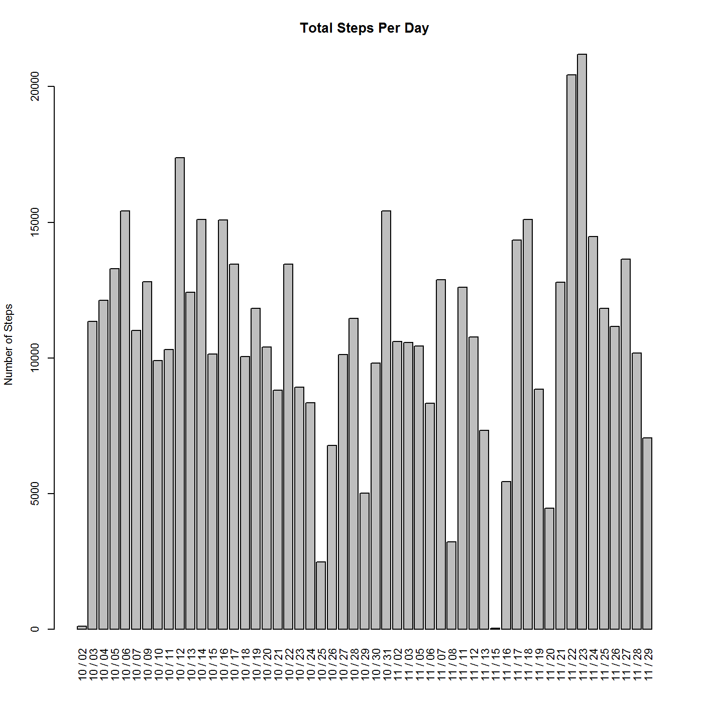
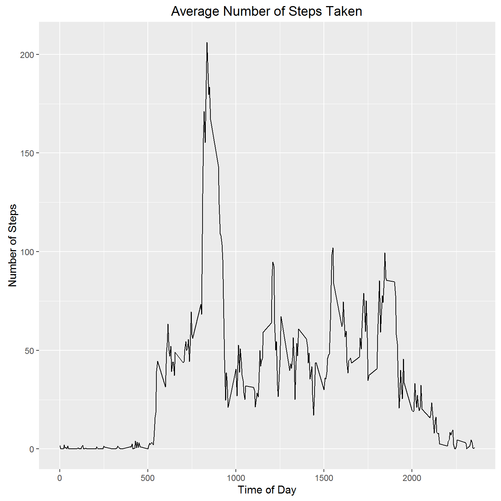
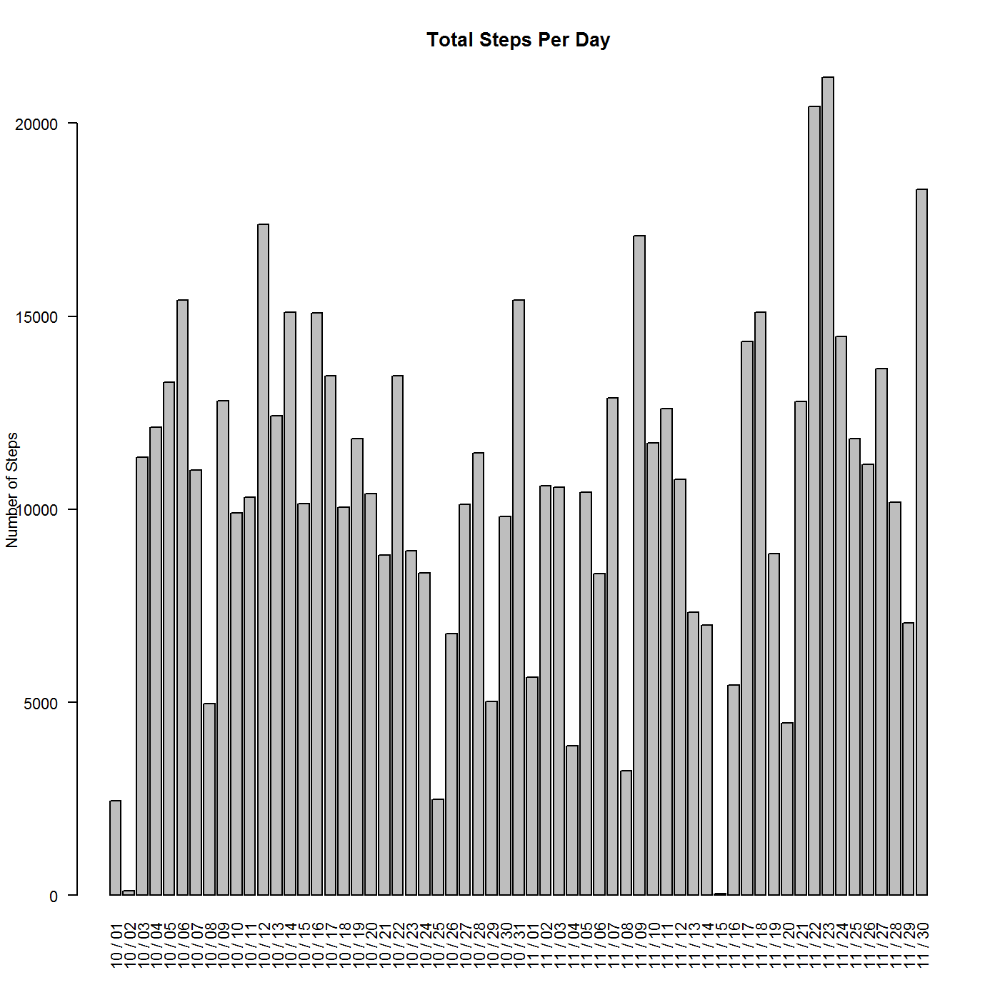
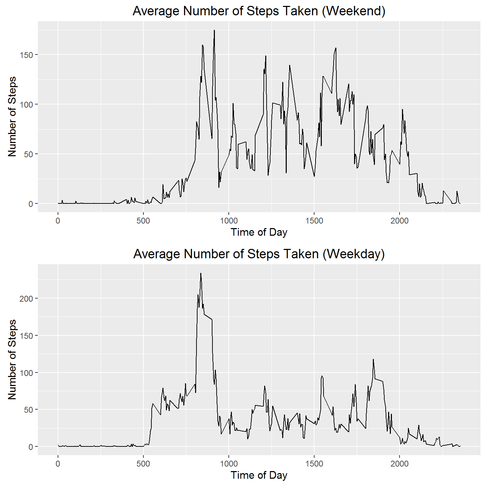

## Purpose: The purpose of this assignment is to perform various data analyses and illustrate the literate programming solutions involved via markdown document.


##1.	Code for reading in the dataset and making a copy without NAs:


```r
setwd("C:\\Data Study\\Class 5 Reproducible Research\\Assignment 1")
rawdata <- read.csv("activity.csv")
rawdata2 <- rawdata[!is.na(rawdata$steps),]
```

##2.	Histogram of the total number of steps taken each day


```r
rawdata2_grouped = group_by(rawdata2, date)
measuredates <- summarise(rawdata2_grouped, sum_steps = sum(steps)) 
dispdate <- as.Date(measuredates$date)
measuredates$dispdate <- format(dispdate, "%m / %d")

barplot(measuredates$sum_steps, names.arg=c(measuredates$dispdate),las=3,ylab="Number of Steps",
         main = "Total Steps Per Day") 
```



##3.	Mean and median number of steps taken each day

```r
print( mean(measuredates$sum_steps))
```

```
## [1] 10766.19
```

```r
print( median(measuredates$sum_steps))
```

```
## [1] 10765
```
##4.	Time series plot of the average number of steps taken
## I interpreted this as: Time series plot of the average number of steps taken #averaging each 5 minute interval across dates in the data set and plotting the average each interval, from 0000 to 2355 (plot of "an average day")

```r
rawdata2_grouped = group_by(rawdata2, interval)
averageinterval <- summarise(rawdata2_grouped, avg_interval = mean(steps)) 

ggplot(averageinterval , aes(interval, avg_interval)) + geom_line() +
  labs(title="Average Number of Steps Taken",x="Time of Day",y="Number of Steps")
```



##5.	The 5-minute interval that, on average, contains the maximum number of steps

```r
measureinterval <- summarise(rawdata2_grouped, sum_interval = sum(steps)) 
m2 <- arrange(measureinterval ,desc(sum_interval))
print("Interval with max steps is: ")
```

```
## [1] "Interval with max steps is: "
```

```r
m2[1,1]
```

```
## # A tibble: 1 x 1
##   interval
##      <int>
## 1      835
```
##6.	Code to describe and show a strategy for imputing missing data
## What we'll do is generate a random number between known min and max values for missing day.
## Set consistent random numberseed, as well as min and max values for existing dates

```r
set.seed(1234)
minsteps <- min(measuredates$sum_steps)
maxsteps <- max(measuredates$sum_steps)
```
##7.	Histogram of the total number of steps taken each day after missing values are imputed
## Create merged data set using distinct dates (regardless of NAs). Generate random numbers. Regenerate labels

```r
distinctdates <- distinct(rawdata,date)
imputeddata <- merge(x = distinctdates , y = measuredates, by = "date", all.x = TRUE)

imputeddata$imputed_or_real_steps <- ifelse(!is.na(imputeddata$sum_steps),imputeddata$sum_steps,sample(minsteps:maxsteps,99)) 
dispdate <- as.Date(imputeddata$date)
imputeddata$dispdate <- format(dispdate, "%m / %d")
barplot(imputeddata$imputed_or_real_steps, names.arg=c(imputeddata$dispdate),las=2,ylab="Number of Steps",
         main = "Total Steps Per Day") 
```



##8.	Panel plot comparing the average number of steps taken per 5-minute interval across weekdays and weekends

```r
rawdata2$day <- weekdays(as.Date(rawdata2$date))
rawdata2$weekend <- ifelse(rawdata2$day == "Saturday" | rawdata2$day == "Sunday",TRUE,FALSE )

weekends <- rawdata2[ rawdata2$weekend == TRUE, ]
weekends_grouped = group_by(weekends, interval)
weekendaverageinterval <- summarise(weekends_grouped, avg_interval = mean(steps)) 

weekday <- rawdata2[ rawdata2$weekend == FALSE, ]
weekday_grouped = group_by(weekday, interval)
weekdayaverageinterval <- summarise(weekday_grouped, avg_interval = mean(steps)) 

plot1 <- ggplot(weekendaverageinterval , aes(interval, avg_interval)) + geom_line()+
  labs(title="Average Number of Steps Taken (Weekend)",x="Time of Day",y="Number of Steps")

plot2 <- ggplot(weekdayaverageinterval , aes(interval, avg_interval)) + geom_line()+
  labs(title="Average Number of Steps Taken (Weekday)",x="Time of Day",y="Number of Steps")

grid.arrange(plot1, plot2, nrow=2)
```


